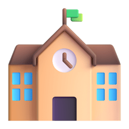

    

<h2 align="center"> 
    < Hi there
    
    I'm Himanshu Rathore />
</h2>

I'm a curious programmer, and a software developer from India who's trying to get a bit better every day. I'm very curious about new technologies. Though I'm in my early software engineering career, I consider myself a self-taught programmer, constantly learning and always looking for improving my skills.

I enjoy creating websites, applications, or anything in between. My passion is about designing and developing web applications that are not only aesthetically pleasing but also highly functional and user-friendly. As a developer, I am committed to producing high-quality, efficient, and scalable code, and I always strive to exceed expectations.

## Connect with me 

- 📫 Reach me out at <a href="mailto:himanshu.2922t@gmail.com" target="_blank">himanshu.2922t@gmail.com</a>
- 🌐 Check out my portfolio at <a href="https://rathore-himanshu.github.io/" target="_blank">rathore-himanshu.github.io</a>
- 🧑🏻‍💻 Open to work for SDE and Fullstack Developer Roles. Download my <a href="" target="blank">Resume</a>

I'm available to work as a freelancer too! 🙂 
    To hire me, drop a mail or connect via any media platforms mentioned below.

     
    
    
    
    
    
    
    

 

## Skills 

In recent years, I've been working on new technologies and languages. These are the ones I've learned so far:

**Frontend Skills**

||||||
|--|--|--|--|--|--|--|
HTML5|CSS3|Tailwind|Material UI|ReactJS|Redux|NextJS|

**Backend Skills**
||||||
|--|--|--|--|--|--|--|
NodesJS|ExpressJS|MongoDB|MySQL|GraphQL|JWT|Redis|

**Programming Languages I code**

|||||
|--|--|--|--|--|--|
C|C++|Javascript|Python|Java|Scala|

**Data & ML**

|||||
|--|--|--|--|--|--|
Apache Spark|Pandas|Numpy|Scikit-learn|Keras|Matplotlib|

**Dev & Design Tools I use**
||||||
|--|--|--|--|--|--|--|
npm|git|linux|VS Code|Vim|figma|illustrator|

 

## Work & Education 

<table align="center">
    <tr>
        <td></td>
        <td>
            <h4>Shallowfeet Consulting</h4>
            <pre>- Fullstack Developer 
- Jaipur, India 
- November 2022 - (Present)</pre>
        </td>
        <td>
            <h4>Tata Consultancy Services</h4>
            <pre>- Software Engineer
- Bangalore, India
- July 2021 - November 2022</pre>
        </td>
        <td>
            <h4>Divam Tech</h4>
            <pre>- Frontend Developer 
- Bangalore, India
- May 2021 - June 2021</pre>
        </td>
    </tr>
</table>
<table align="center">
    <tr>
        <td>
            
        </td>
        <td>
            <h4>Rajasthan Technical University</h4>
            <pre>- B.Tech in Computer Science and Engineering
- Jaipur, India
- June 2017 - July 2021
- CGPA: 8.4 / 10</pre>
        </td>
</table>
<table align="center">
    <tr>
        <td>
            
        </td>
        <td>
            <h4>Forsk Technologies</h4>
            <pre>- Data Science Intern 
- Jaipur, India
- August 15, 2021 – May 22, 2022</pre>
        </td>
        <td>
            
        </td>
        <td>
            <h4>Freelancing</h4>
            <pre>- Graphics Designer
- Remote, India
- August, 2017 – November, 2020</pre>
        </td>
    </tr>
</table>

  

## Things I like to do in my free time 
<pre>Outside work, I love to
- 🧑🏻‍💻 solve DSA problems
- 🙏🏻 meditate and pray
- 📖 read books
- 🖌️ do painting and skecthing
- 🎵 listen to spiritual podcasts/songs
- 🌴 explore nature outdoors</pre>

## Loved my work? 

&nbsp;[Give a star to this project](https://github.com/rathore-himanshu/rathore-himanshu)  
&nbsp;[Follow me on GitHub](https://github.com/rathore-himanshu) 
&nbsp;[Checkout my portfolio]() 
&nbsp;[Read my blogs]() 
 [Buy me a coffee](https://www.buymeacoffee.com/himanshurathore) (Tired of drinking Tea)

### Thanks for visiting!&nbsp;
